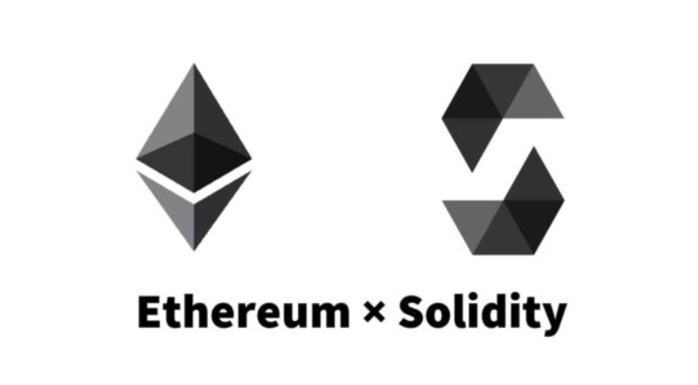
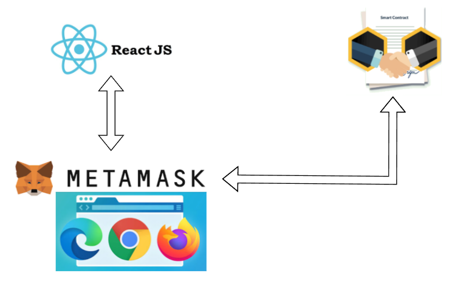
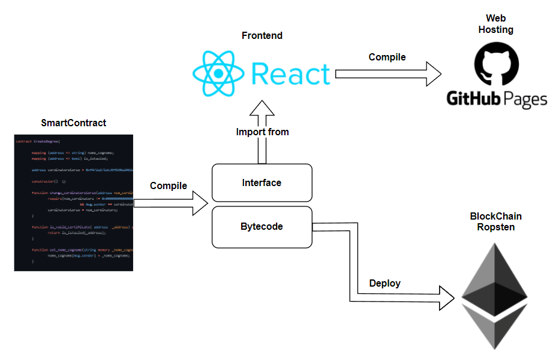

# degre certificate but on blockhcain

Proof of concept di come uno Smartcontract interagisce con il web per gestire certificati rilasciati da una commissione

[Link prova live](https://naddi96.github.io/degree-certificate-but-on-blockchain/)

---

# Requisiti 

- Creazione di certificati Da parte del Coordinatore
- Firma dei certificati da parte della commissione
- visualizzazione dei certificati 

---

---

# Smart contract

---

# smart contract 
- raccolta di funzioni e dati (il suo stato) che  se istanziato risiede a un indirizzo specifico sulla blockchain
- le funzioni implementate possono
    - vedere lo stato
    - modificare lo stato
    - applicare anche restrizioni a chi può modificare lo stato del contratto.

---

# Due contratti

- **CreateDegree**  viene istanziato quando viene fatto il deploy sulla blockchain 

- **DegreeBlock** viene istanziato da **CreateDegree** quando si crea un nuovo certificato

---

# Frontend

 
---

# Struttura 

---

# Deploy 

---

# [Prova Live](https://naddi96.github.io/degree-certificate-but-on-blockchain/)

